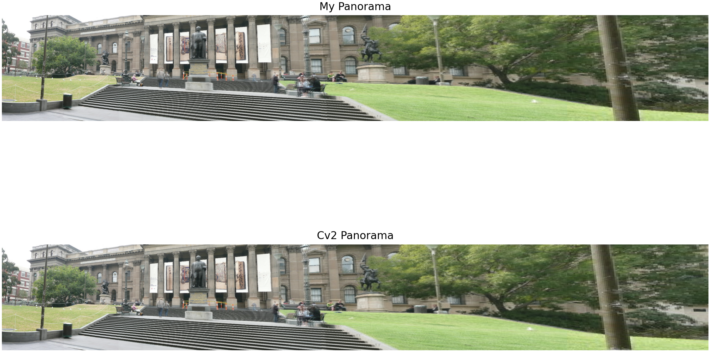
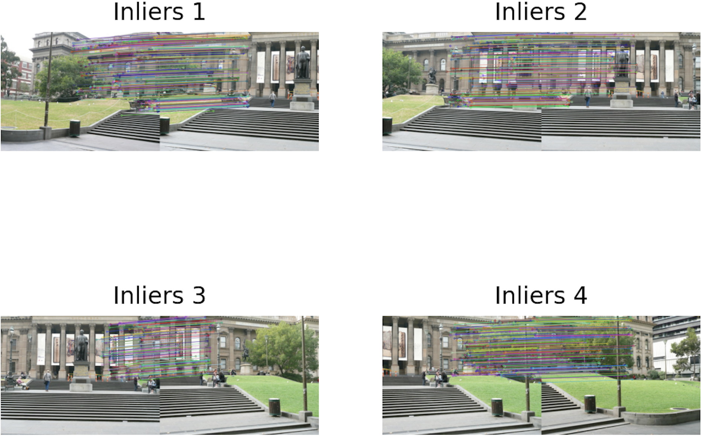
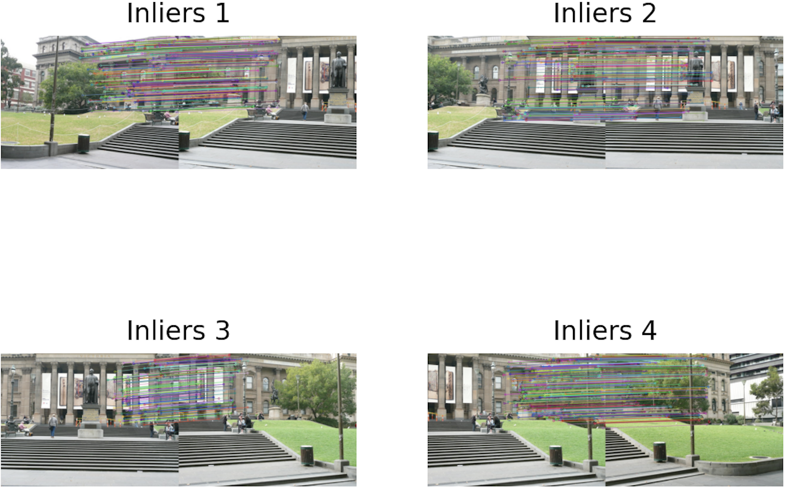
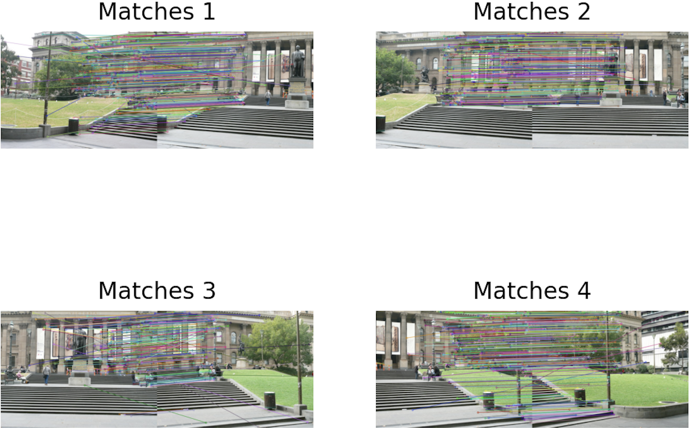
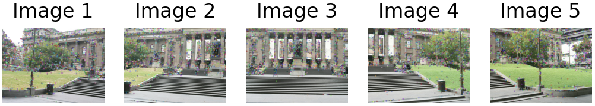

## About

In this project we compose a panorama from five different images that illustrate the same 3D scene, from slightly different viewpoints. The main objective of this project is to implement the RANSAC algorithm (Random Sample Consensus) in order to calculate the homography transformation between each pair of images, that transforms one image to the coordinate frame of the other. Finally, by making use of the estimated homographies, we stitch the images together, thus forming a panoramic image.

## Prerequisites 

Install OpenCV:
```
pip install opencv-python
```

Install Matplotlib:
```
pip install matplotlib
```

Install NumPy:
```
pip install numpy
```

## Run:
```
python ImageStitching.py
```

## Python Version
Python 3.7.11

## Author

Theodoros Kyriakou

## Results

Input Images        


Panorama        


My implementation of RANSAC Inliers        


RANSAC Inliers        


SIFT Feature Matching        


SIFT Keypoints        



